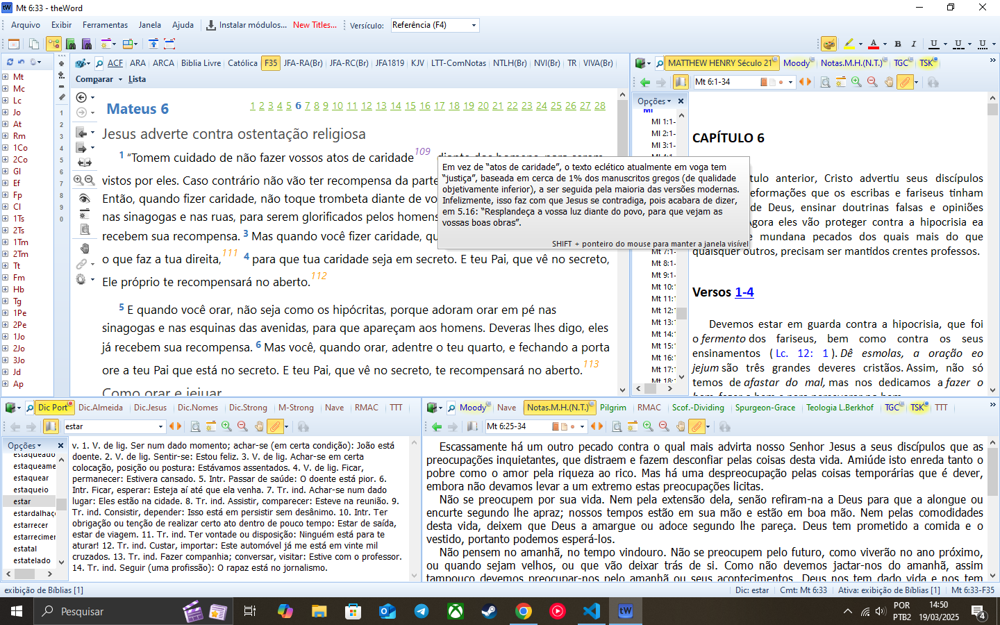

# TheWord

Esse projeto tem como objetivo criar módulos para o [**TheWord**](https://www.theword.net), que é um software livre para auxiliar os estudos da Bíblia. Inicialmente pretendo converter para um módulo de Bíblia o **Novo Testamento segundo a Família 35**, tradução do **Dr. Wilbur Norman Pickering**, extraída do livro [**O Soberano Criador Já Falou, 3° Edição**](https://www.prunch.com.br/wp-content/uploads/2024/08/O-Soberano-Criador-ja-Falou-3-br-c.pdf).

Print mostrando uma parte do texto convertido, com as notas do autor:


## Como está organizado - o que cada arquivo faz?
```bash
├── input-notes.txt
├── input-verses.txt
├── live-edit.txt
├── merged.txt
├── modules
│   └── bible
│       └── f35
│           ├── F35.nt
│           └── mateus.nt
├── perl
│   ├── index.pl
│   └── lib
│       ├── Format.pm
│       ├── Merge.pm
│       └── number-note.log
```
* **input-notes.txt** recebe texto de notas copiadas do PDF, sem alteração;
* **input-verses.txt** recebe texto da tradução, sem alteração;
* **live-edit.txt** recebe o texto que deverá ser editado pelo usuário; inserindo tags de títulos, subtítulos e referência de notas com (*);
* **merged.txt** recebe o texto final.