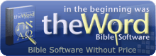

# TheWord

**Esse projeto tem como objetivo criar módulos para o TheWord, que é um software livre que auxilia os estudos da Bíblia. Inicialmente pretendo converter para um módulo de Bíblia o Novo Testamento segundo a Família 35, tradução do Dr. Wilbur Norman Pickering**.

