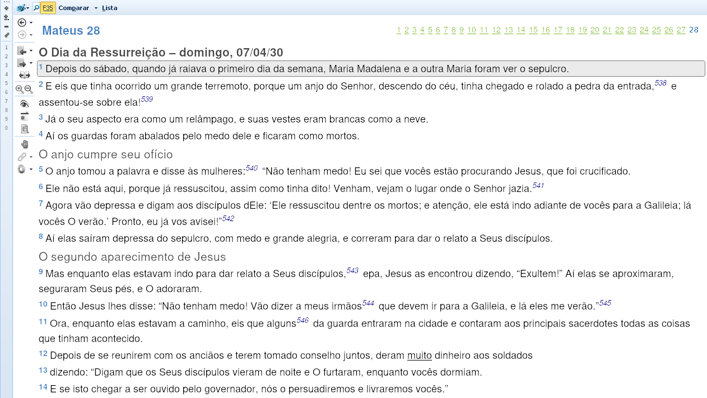

# TheWord - Módulo de Bíblia Família 35

Esse projeto tem como objetivo criar módulos para o [**TheWord**](https://www.theword.net), que é um software livre para auxiliar os estudos da Bíblia. Inicialmente pretendo converter para um módulo de Bíblia o **Novo Testamento segundo a Família 35**, tradução do **Dr. Wilbur Norman Pickering**, extraída do livro [**O Soberano Criador Já Falou, 3° Edição**](https://www.prunch.com.br/wp-content/uploads/2024/08/O-Soberano-Criador-ja-Falou-3-br-c.pdf).



## Como obter o módulo?

* Abra o terminal na pasta onde queira baixar os arquivos e faça os seguintes procedimentos:
* Página de download do _git_, se você não tiver: https://git-scm.com/downloads.

```
git clone https://github.com/HelenoSalgado/theword.git
```
* Agora vai em **instalar novos módulos** em seu software e abra o módulo de Bíblia em ***theword/modules/bible/f35/F35.nt***

* Para obter os livros e capítulos conforme vão sendo adicionados, é só abrir o terminal no repositório (pasta) e atualizá-lo, assim:
```
git pull
```
**Observação**: Você pode apenas copiar o arquivo principal (F35.nt) e colar na sua pasta personalizada de módulos, ou então criar um link simbólico para lá, o que recomendo, já que poderá correr `git pull` no repositório git e atualizá-lo a qualquer momento.

## Uma maneira mais fácil
Outra forma de obter o módulo no atual estágio, sem possibilidade de atualização, é simplesmente baixar o arquivo principal, e depois carregá-lo no TheWord:

[**F35.nt**](https://github.com/HelenoSalgado/theword/blob/main/modules/bible/f35/F35.nt)

## Estrutura de pastas
```bash
├── input-notes.txt
├── input-verses.txt
├── edit-notes.txt
├── edit-verses.txt
├── merged.txt
├── modules
│   └── bible
│       └── f35
│           ├── F35.nt
│           ├── mateus.nt
│           └── marcos.nt
├── perl
│   ├── index.pl
│   └── lib
│       ├── Format.pm
│       └── Merge.pm
```
## O que cada arquivo faz?

* **input-verses.txt** recebe texto da tradução, sem alteração;
* **input-notes.txt** recebe texto de notas copiadas do PDF, sem alteração;
* **edit-verses.txt** aqui o texto recebe a formatação própria do TheWord: tags de títulos, subtítulos e referência de notas com (*);
* **edit-notes.txt** aqui as notas recebem a formatação própria do TheWord;
* **merged.txt** recebe o texto final (As notas são incorporadas ao texto da Bíblia, para cada asterísco uma nota é adicionada).

**Obs**: _Cada linha de texto no arquivo F35.nt corresponde a um versículo_.

> Seca-se a erva, e cai a flor, porém a palavra de nosso Deus subsiste eternamente (Isaías 40.8).